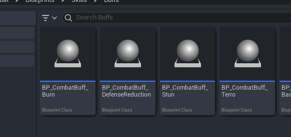
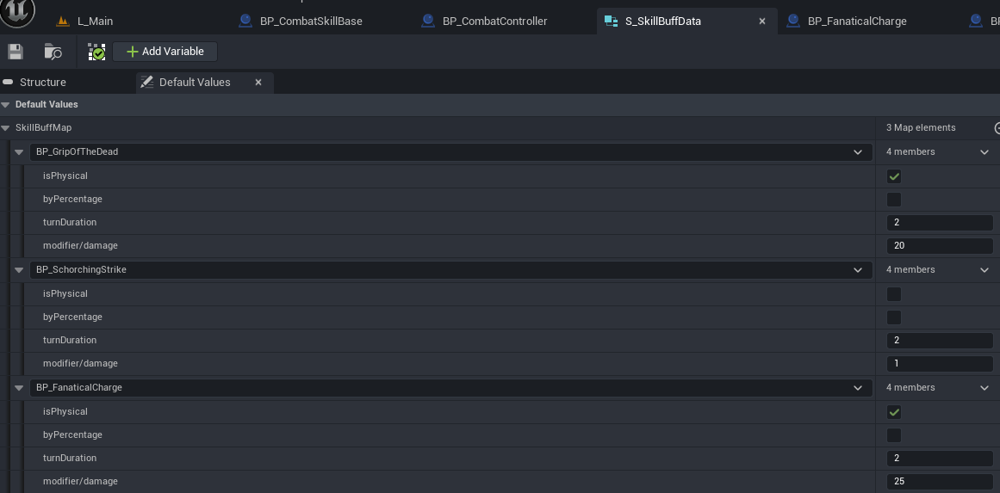
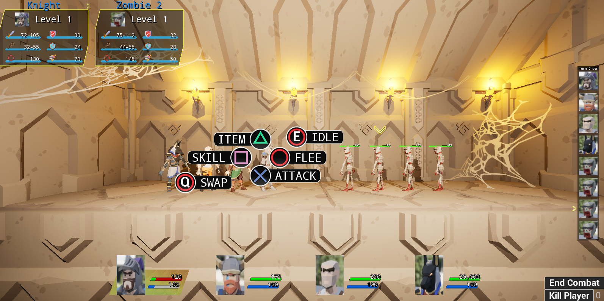

# The Guild - Gameplay Loop Team 1 Weekly Report (Week 2)

## Week Overview

This week, we've made substantial progress on our combat system by completing most of the core mechanics we outlined in our previous report. Building upon last week's foundational position system, we've successfully implemented status effects, completed the stress system, finalized near-death state mechanics, and enhanced the overall look and feel of the combat experience.

## Key Implementations

### Status Effects System

We've successfully implemented four distinct buff/debuff types, each with unique visual indicators and gameplay effects:

- **Burning**: Deals damage over time
- **Armor Reduction**: Decreases defense stats
- **Stun**: Prevents action for a duration
- **Fear**: Increases stress value over time

We've also connected our skills system to the status effects, allowing abilities to apply these effects to units. The backend system manages duration, stacking rules, and application conditions.

### Stress System Completion

The stress system has been fully implemented and connected to gameplay consequences:

- Fear debuffs now incrementally increase a character's stress value
- When stress reaches 100, characters receive performance-reducing debuffs
- At 200 stress, characters automatically enter the near-death state regardless of HP

This creates an additional management layer for players, forcing them to balance both HP and stress levels during combat encounters.

### Near-Death State Mechanics

We've completed the implementation of the near-death state:

- Characters now enter a near-death state when their HP drops to 0 instead of dying immediately
- Characters in near-death state who take additional damage face probability-based death checks
- The probability of failing these checks increases with each hit, creating mounting tension
- Failed checks result in permanent character death

### Status of Random Calculation System

While we've built the backend framework for randomized attribute calculations, we're still working on fully integrating this system with our combat mechanics. This presents some challenges as calculation code is currently scattered throughout various systems. We're developing a more structured approach to ensure consistent randomization behaviors across all combat elements.

## Additional Achievements

Beyond our core planned features, we've made several enhancements to improve the overall experience:

### Combat Environment Development

We've constructed a basic battle arena with lighting and environmental elements that simulate the dark, oppressive atmosphere of a dungeon setting. This provides a more immersive backdrop for our combat encounters.

### Character Assets Integration

We've replaced the placeholder models with proper character assets, implemented appropriate animations, and added character-specific sound effects. This significant upgrade allows players to clearly identify different units and understand their actions.

### Audio Enhancements

We've implemented background music that enhances the dungeon atmosphere while normalizing sound effect volumes to prevent jarring audio experiences. The development team reports being "thoroughly brainwashed" by the looping dungeon theme - a sign of proper immersion!

### Development Tooling

We've created command-line shortcuts for frequently tested functions, significantly reducing development time and allowing for rapid iteration.

### GameInstance Team Loading

We've implemented a system to load team rosters through GameInstance, laying groundwork for future integration with other game modules. This will ensure smooth transitions between the exploration, base building, and combat systems.

## Next Steps

For the coming sprint, our priorities include:

1. Consulting and collaborating with Group 2 to plan for integration
2. Conducting knowledge-sharing sessions to facilitate smooth merging
3. Beginning the formal process of integrating our combat system with the main game
4. Refining status effect visual feedback and UI elements
5. Balancing near-death state probabilities and stress thresholds

## Conclusion

After a productive sprint, my team and I are pleased to announce that our combat system has reached the quality threshold required for integration into the complete gameplay loop. Everything is proceeding according to plan, and we are excited to begin the initial integration and quality polishing in the upcoming sprints.