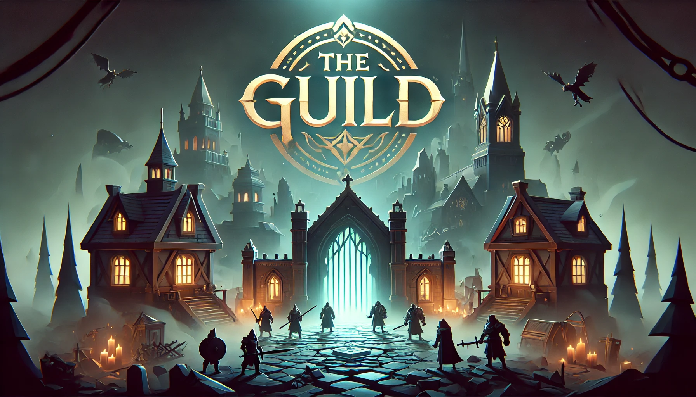

## 🎮 Welcome to **Gameplay Loop Team 1**! 🚀  

Hey there, fellow game enthusiasts! Welcome to the **Gameplay Loop Team 1** repo, where we turn caffeine, code, and chaos into an epic gaming experience. We’re on a mission to craft the ultimate **gameplay experience**—bringing together **base building, dungeon crawling, exploration, and (hopefully) some balanced combat!**  

---

## 🏆 Meet the Team  

<table>
  <tr>
    <td align="center"> <b>Xing Chen</b>  🏀 The Shot Caller ✨ Loves: Basketball 🏀, Video Games 🎮 💡 Secret Talent: Can strategize both on the court and in the code. 🎤 Catchphrase: "Just one more bug fix... okay, maybe one more..."</td>
    <td align="center"> <b>Hongjun Xu</b>  🎮 The Tech Wizard ✨ Loves: Gaming 🎮, Cutting-Edge Tech 🧠 💡 Secret Talent: Can probably automate your life with an AI script. 🎤 Catchphrase: "If it compiles, it works… probably."</td>
    <td align="center"> <b>Baizhen Lin</b>  ♟️ The Grandmaster ✨ Loves: Volleyball 🏐, Go (围棋) ♟️ 💡 Secret Talent: Can outplay both players and NPCs at the same time. 🎤 Catchphrase: "Everything is a calculated move. Even my coffee intake."</td>
  </tr>
  <tr>
    <td align="center"> <b>Yingxuan Tang</b>  🎾 The Powerhouse ✨ Loves: Tennis 🎾, Physics & Mechanics 🛠️ 💡 Secret Talent: Can serve a tennis ball faster than you can debug a loop. 🎤 Catchphrase: "What do you mean gravity doesn’t work like that?"</td>
    <td align="center"> <b>Jin Zhang</b>  🕵️‍♂️ The Mystery Coder ✨ Loves: (Coming soon...) 💡 Secret Talent: May or may not be a coding ninja in disguise. 🎤 Catchphrase: "I exist in the shadows… and in the codebase."</td>
    <td align="center"> <b>Shuqi Zhuang</b>  🤔 The Enigma ✨ Loves: Reading 📚, Watching Movies 🎬 💡 Secret Talent: Can probably solve a Rubik’s Cube faster than your PC can boot up. 🎤 Catchphrase: "I’ll let my code do the talking."</td>
  </tr>
  <tr>
    <td align="center" colspan="3"> <b>Qi Ji</b>  💡 The Think Tank ✨ Loves: (To be discovered...) 💡 Secret Talent: Can brainstorm a thousand ideas per second (but implementing them is another story). 🎤 Catchphrase: "Wouldn’t it be cool if… oh wait, never mind."</td>
  </tr>
</table>

---

## 🎯 What Are We Working On?  

We are designing the core **gameplay loop** for our game, which includes:  
✅ **Base Building** – Construct, upgrade, and expand your settlement.  
✅ **Dungeon Exploration** – Procedurally generated dungeons filled with surprises.  
✅ **Map Discovery** – Find new areas, hidden quests, and secrets.  
✅ **Combat System** – Engaging and (hopefully) balanced battle mechanics.  

We’re combining our **game design expertise** with **pure passion for gaming** to make something awesome!  

---

## 🤝 Join the Fun!  

Want to follow our journey? Feel free to:  
⭐ **Star this repo** for updates!  
🐛 **Report bugs** (but don’t judge us too hard, we’re trying!)  
💬 **Give feedback** – We love constructive criticism! Contact us: u7725171@anu.edu.au

Stay tuned for **dev logs, GIFs, and inevitable feature creep!** 🚀
