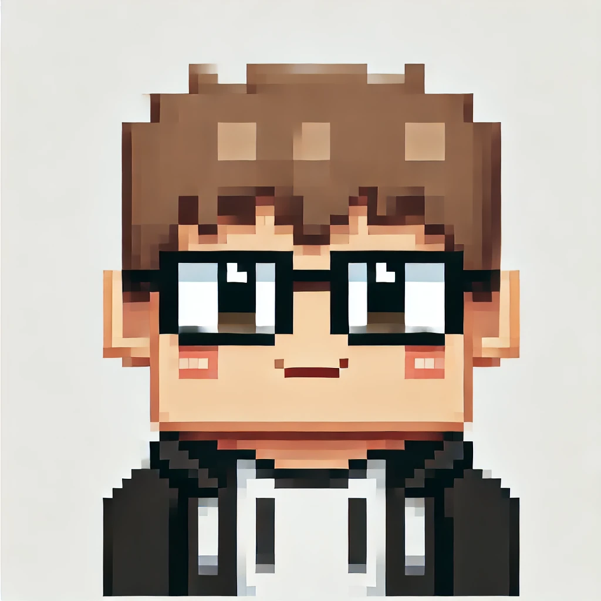
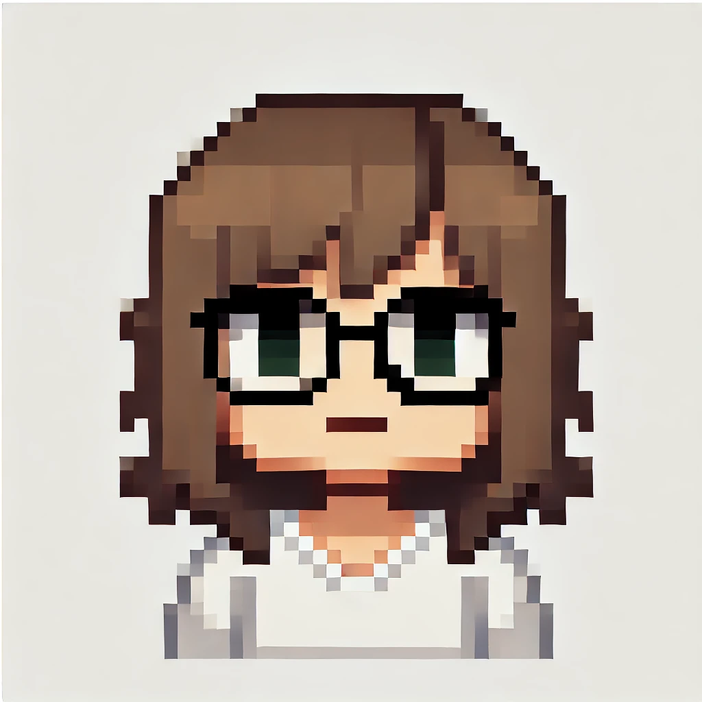
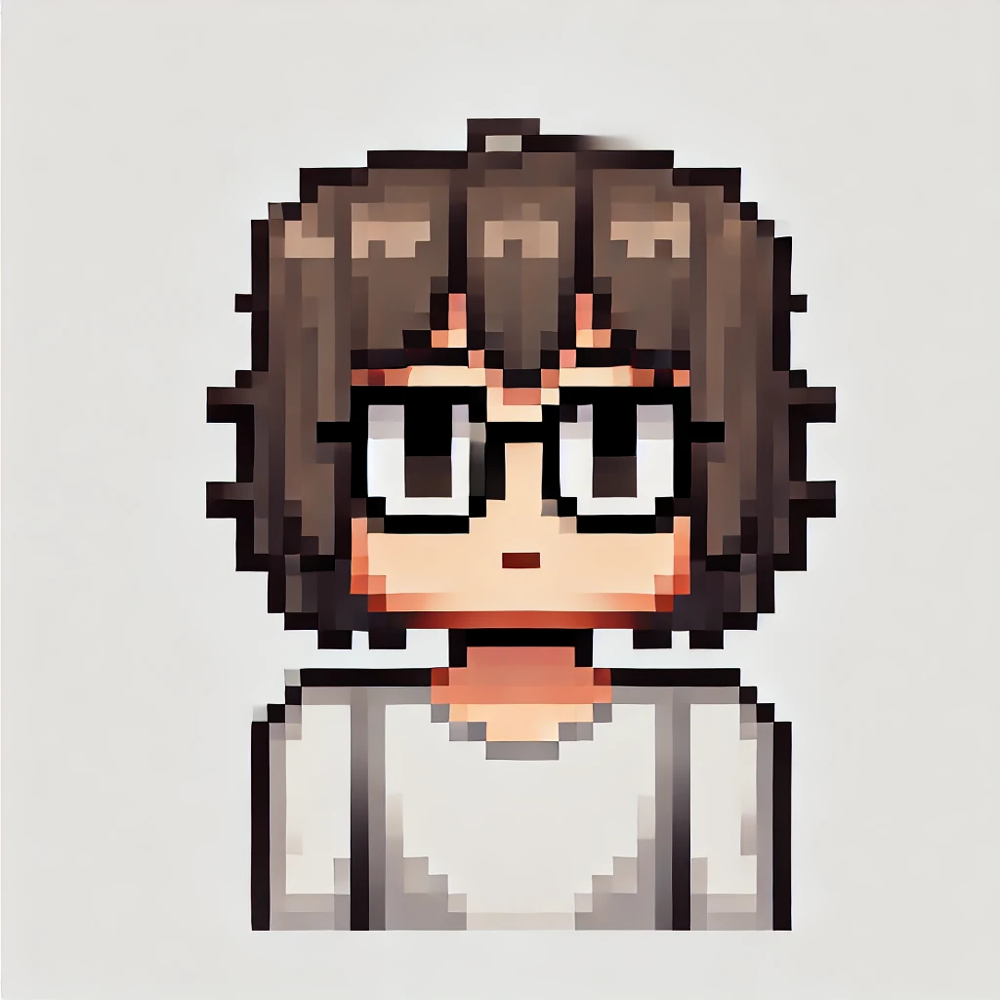

# The Guild - A UE5 Game Project

🎮 **The Guild** is a medieval fantasy game developed by a team of ANU students using **Unreal Engine 5**. Featuring core gameplay elements such as **base building, exploration, and combat**, players can build and expand their own guild, recruit heroes, and overcome various challenges.

After **two semesters of development**, and thanks to the hard work of everyone involved, the game is finally complete!

---

## 📽️ Demo Video

Curious about the gameplay? Watch our demo video here:

👉 [Watch the demo video](https://drive.google.com/your-demo-video-link)

---

## 💾 Download & Play (Windows Only)

Try out the game by downloading the Windows build here:

👉 [Download Playtest Build](https://drive.google.com/file/d/1Z0Th0IE40zsJnf6UYpFXBBvlMKVQD8a_/view?usp=sharing)

> ⚠️ Currently available for **Windows only**.

---

## 🤝 Collaboration Repository

We worked together with another group to co-develop part of the project. You can check out the shared module here:

👉 [Collaboration GitHub Repository](https://github.com/southern-cross-ai/Deep_Dark_Dungeon_Forked/tree/main)

---

## 📚 Want to know more about our development journey?

We documented our inspirations, challenges, and milestones along the way. Read more on our project page:

👉 [Explore our development story](https://southerncross.ai/Boys-Next-Door/)

---

## 🏆 Meet the Team  

<table>
  <tr>
    <td align="center"> <b>Xing Chen</b>  🏀 The Shot Caller ✨ Loves: Basketball 🏀, Video Games 🎮 💡 Secret Talent: Can strategize both on the court and in the code. 🎤 Catchphrase: "Just one more bug fix... okay, maybe one more..."</td>
    <td align="center"> <b>Hongjun Xu</b>  🎮 The Tech Wizard ✨ Loves: Gaming 🎮, Cutting-Edge Tech 🧠 💡 Secret Talent: Can probably automate your life with an AI script. 🎤 Catchphrase: "If it compiles, it works… probably."</td>
    <td align="center"> <b>Baizhen Lin</b>  ♟️ The Grandmaster ✨ Loves: Volleyball 🏐, Go (围棋) ♟️ 💡 Secret Talent: Can outplay both players and NPCs at the same time. 🎤 Catchphrase: "Everything is a calculated move. Even my coffee intake."</td>
  </tr>
  <tr>
    <td align="center"> <b>Yingxuan Tang</b>  🎾 The Powerhouse ✨ Loves: Tennis 🎾, Physics & Mechanics 🛠️ 💡 Secret Talent: Can serve a tennis ball faster than you can debug a loop. 🎤 Catchphrase: "What do you mean gravity doesn’t work like that?"</td>
    <td align="center"> <b>Jin Zhang</b>  🕵️‍♂️ The Mystery Coder ✨ Loves: Watching TV Series 📺 💡 Secret Talent: May or may not be a coding ninja in disguise. 🎤 Catchphrase: "I exist in the shadows… and in the codebase."</td>
    <td align="center"> <b>Shuqi Zhuang</b>  🤔 The Enigma ✨ Loves: Reading 📚, Watching Movies 🎬 💡 Secret Talent: Can probably solve a Rubik’s Cube faster than your PC can boot up. 🎤 Catchphrase: "I’ll let my code do the talking."</td>
  </tr>
  <tr>
    <td align="center" colspan="3"> <b>Qi Ji</b>  💡 The Think Tank ✨ Loves: Watching TV Series 📺, Playing Board Games 🎲 💡 Secret Talent: Can brainstorm a thousand ideas per second (but implementing them is another story). 🎤 Catchphrase: "Wouldn’t it be cool if… oh wait, never mind."</td>
  </tr>
</table>

---

## 🎯 What Are We Working On?  

We are designing the core **gameplay loop** for our game, which includes:  
✅ **Base Building** – Construct, upgrade, and expand your settlement.  
✅ **Dungeon Exploration** – Procedurally generated dungeons filled with surprises.  
✅ **Map Discovery** – Find new areas, hidden quests, and secrets.  
✅ **Combat System** – Engaging and (hopefully) balanced battle mechanics.  

We’re combining our **game design expertise** with **pure passion for gaming** to make something awesome!  

---

## 🙌 Thank You for Your Support!

If you enjoyed our game, please consider giving us a ⭐ on GitHub or leaving feedback. We'd love to hear from you!
